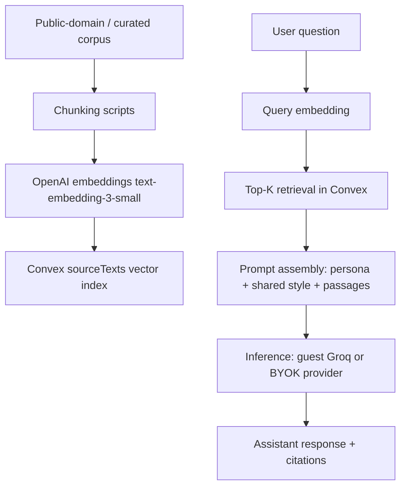

# Ask the Ancients

An open-source experiment in retrieval-grounded philosophy chat.

## What is this?

Ask the Ancients is a Next.js + Convex app where you can chat with historical philosophers using responses grounded in source passages, not generic roleplay. Current roster includes Marcus Aurelius, Seneca, Epictetus, Patanjali, Adi Shankaracharya, Aristotle, Spinoza, The Buddha, Mahavira, and Ramanuja.

## Why it exists

Most philosophy apps either feel like trivia or generic LLM chat. This project explores whether a small, inspectable RAG stack can make philosophical inquiry more curious, concrete, and verifiable.

## Features

- Retrieval-grounded responses with source citations
- Philosopher-specific system prompts plus a shared conversation style contract
- Convex vector search over corpus chunks (OpenAI `text-embedding-3-small`)
- Guest mode + signed-in mode (Clerk) + BYOK model support
- Daily limits on shared guest inference (default: anonymous `10/day`, signed-in `25/day`)
- BYOK model/key selection (Groq, Anthropic, OpenRouter, OpenAI-compatible endpoints)
- Citation UX: inline accordion on mobile, dedicated citation rail on desktop
- Bookmarks and thread history with anon-to-user merge on sign-in

## Planned (Agora)

- `Comparison Mode`: place two philosophers in structured comparative inquiry
- `Library`: browse source passages and works directly, outside chat

## Tech Stack

- Frontend: Next.js (App Router), React, TypeScript
- Backend: Convex (DB + functions + vector search)
- Auth: Clerk
- Embeddings: OpenAI `text-embedding-3-small`
- Inference:
  - App default guest path: Groq (`llama-3.3-70b-versatile`)
  - BYOK path: user-selected provider/model
- Package manager/runtime: Bun

## How it works



## Local setup

### Prerequisites

- Bun
- Convex account/project
- Clerk project (for sign-in flows)
- `GROQ_API_KEY` (guest mode)
- `OPENAI_API_KEY` (required for ingestion + retrieval embeddings)
- `MERGE_PROOF_SECRET` (required for secure anon→user merge proof)

### Install and run

```bash
bun install
cp .env.example .env.local
bunx convex dev
bun dev
```

### Useful scripts

```bash
bun dev
bun build
bun start
bun lint
bun typecheck
bun test
bun test:watch
bun run ingest
bun run ingest:dry-run
bun run eval
bun run coach
```

## Safety & Respect

- Comparative features are framed as respectful inquiry, not debate-as-combat.
- Indian philosophers are treated as living intellectual traditions, not caricatures.
- Outputs are generated interpretations grounded in retrieved public-domain/curated texts; they are not authoritative translations or scholarly editions.

## Related docs

- [ARCHITECTURE.md](ARCHITECTURE.md)
- [CONTRIBUTING.md](CONTRIBUTING.md)
- [ATTRIBUTION.md](ATTRIBUTION.md)
- [ADDING_PHILOSOPHERS.md](ADDING_PHILOSOPHERS.md)
- [docs/LEARNING_COACH_USAGE.md](docs/LEARNING_COACH_USAGE.md)
- [docs/learning-progress.md](docs/learning-progress.md)

## License status

Project code license file is currently missing. Add a top-level `LICENSE` before public release. Corpus/source licensing notes are in [ATTRIBUTION.md](ATTRIBUTION.md).
